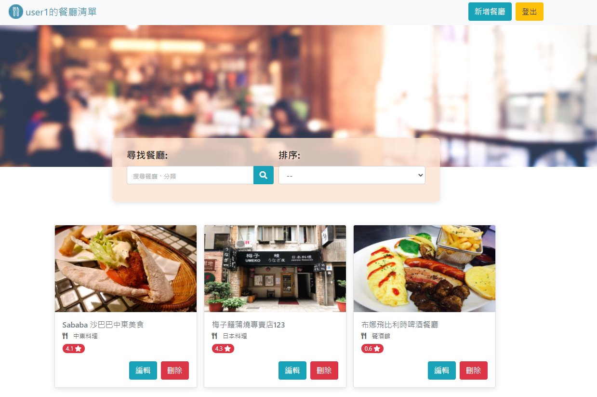
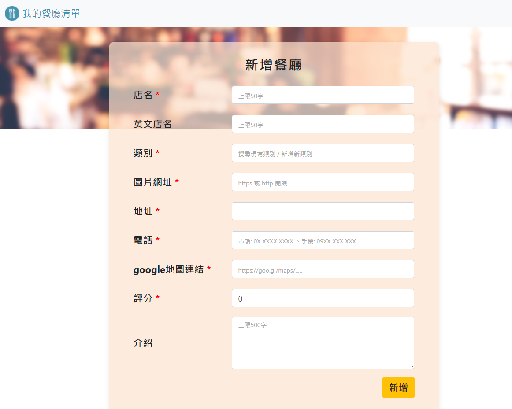

# 餐廳美食清單
透過Express建立的簡易餐廳清單，幫助使用者快速查找餐廳，即刻預約享用美食~

## 功能描述
* 在首頁快速瀏覽所有餐廳

* 點擊餐廳圖卡，查看更多詳細資訊，包含: 地址、電話、簡介等

* 搜尋餐廳中英名稱、類別

* 依照店名、類別或評分進行排序

* 新增/編輯餐廳資料

  * 類別欄位: 可搜尋既有類別或建立新類別
    * 點選輸入框，可展開既有類別下拉式選單，選單上有標註類別下的餐廳數量，並依照數量、類別名稱排序
    * 可在輸入框輸入類別關鍵字搜尋相關類別，下拉式選會自動進行篩選
    * 也可以直接輸入新類別，送出表單時會自動建立新類別
  * 送出表單後會經過client及server端雙重驗證後，再存入資料庫

* 刪除餐廳資料 (刪除前會先跳出確認視窗，確認後才會刪除)

  

## 環境建置需求
* Node.js: v10.15.0
* npm: 6.4.1
* nodemon: 2.0.4
* express: 4.17.1
* express-handlebars: 5.1.0
* body-parser: 1.19.0
* mongoDB: 4.2.9
* robo 3T: 1.4.1
* mongoose: 5.10.7

## 使用方式
1. 在terminal 輸入` git clone https://github.com/Kaikai8888/restaurant_list_2.git `，下載專案資料夾 
2. 透過robo 3T操作mongoDB， 與本機 `localhost: 27017`建立連線，並建立名稱為`restaurant-list`的資料庫
3. 在terminal 輸入 `npm run seed`，透過 nodemon 執行 restaurantSeeder.js，建立種子資料
4. 在terminal 輸入 `npm run dev`，透過 nodemon 執行 app.js，建立資料庫連線，並啟動local server監聽 
5. 在瀏覽器網址輸入 http://localhost:3000，進入網站

