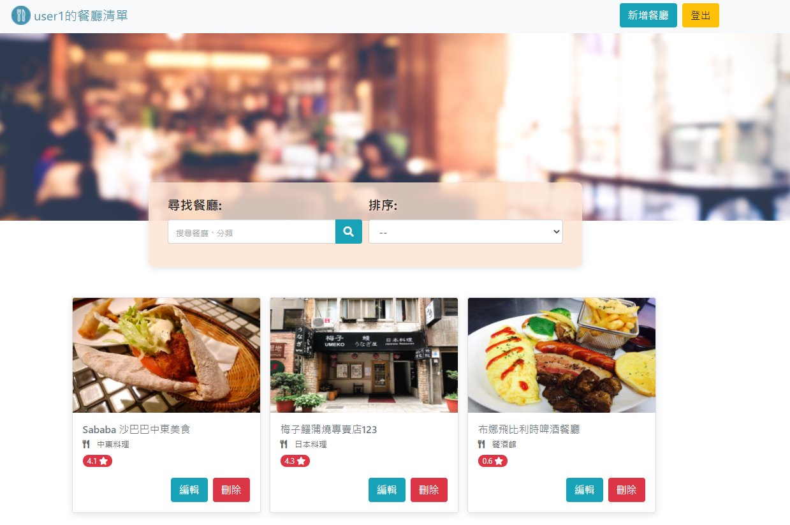
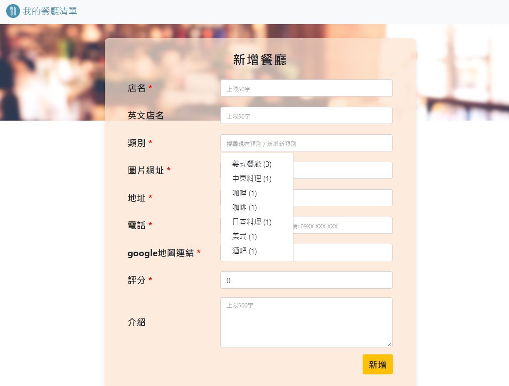
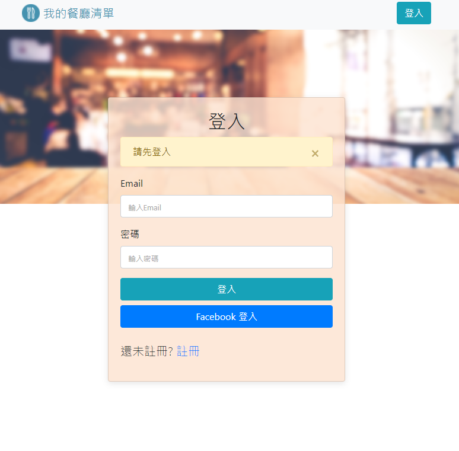
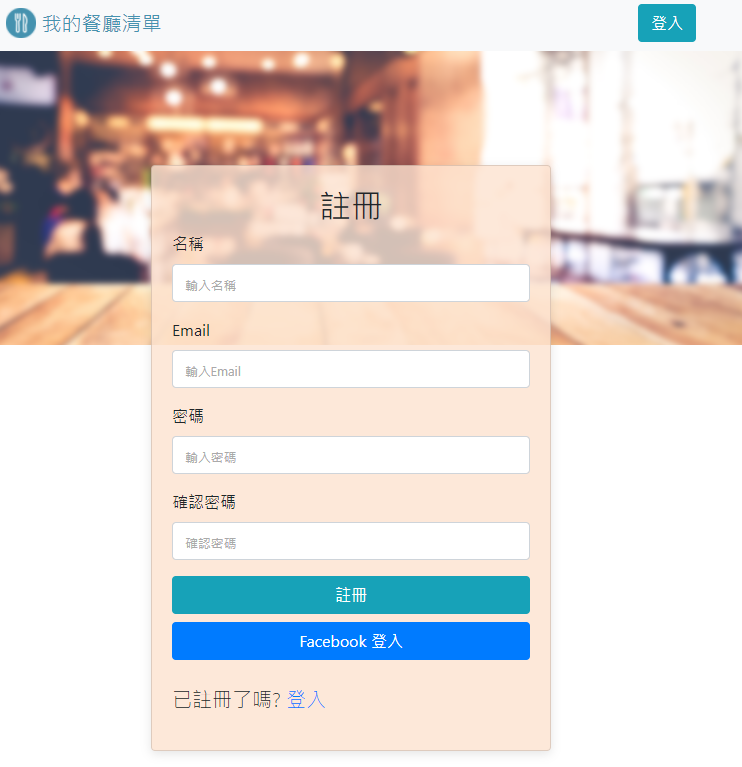

# Restaurant List
A web app built by Express.js to help users manage favorite restaruants.

## Features
* Create an account to manage restaurant list

* Browse all restaurants on home page

* Click on certain restaurant name or image to check detail info, such as address, phone number and description

* Search restaurants by Chinsese name ,English name or category

* Sort restaurants by name, category or ratings

* Creat or Edit restaurants data

  * Categoric field: search existing categories or creating new one
    * Click on the input field to expand category dropdown list
    * The category dropdown list contains category names and numbers of restaurants belong to each category, and is sorted by numbers of restaurants and category name
    * Enter keywords and the dropdown list will be automatically filtered and show related categories
    * Users can also directly enter new category, and the system will create new category in the database after form submission and validation

  * When submitted, the form input will go through  client-end and server-end validation before being stored into the database.

* Delete specific restaurant data by clicking on delete button, and a confirm modal will popup before the deletion.

## Prerequisite
* Node.js: v10.15.0
* npm: 6.4.1
* nodemon: 2.0.4
* express: 4.17.1
* express-handlebars: 5.1.0
* body-parser: 1.19.0
* mongoDB: 4.2.9
* robo 3T: 1.4.1
* mongoose: 5.10.7
* bcryptjs: ^2.4.3
* connect-flash: 0.1.1
* dotenv: 8.2.0
* express-session: 1.17.1
* passport: 0.4.1
* passport-facebook: 3.0.0
* passport-local: 1.0.0

## Installation
1. Enter ` git clone https://github.com/Kaikai8888/restaurant_list_2.git ` in the terminal to download the project folder
2. Use robo 3T to manipulate mongoDB, create connection to `localhost: 27017`, and create the database,`restaurant-list`
3. Enter `npm run seed` in the terminal to to run restaurantSeeder.js with nodemon and create seed data
4. Enter `npm run dev` in the terminal to run app.js with nodemon to set up database connection and start local server 
5. Enter http://localhost:3000 in the browser and enter the website
6. User following demo account to login:
  * user1: 
    - email: user1@example.com
    - password: 12345678
  * user2:
    - email: user2@example.com
    - password: 12345678

